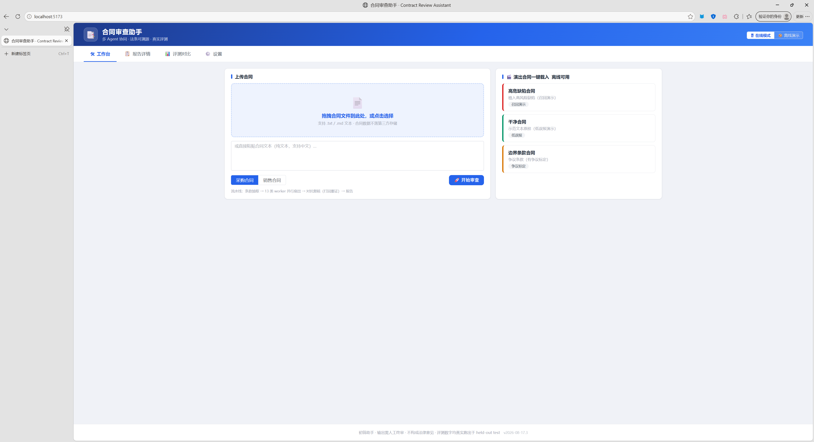
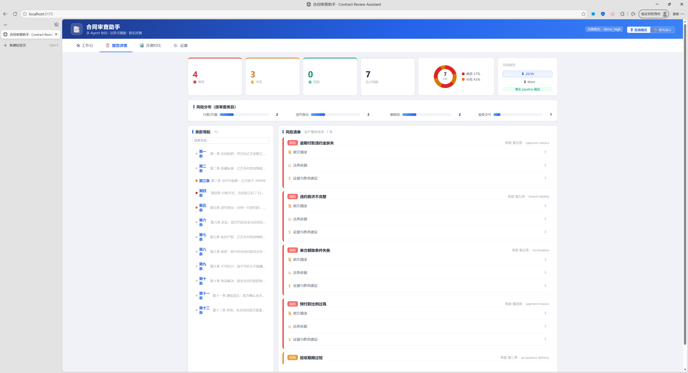
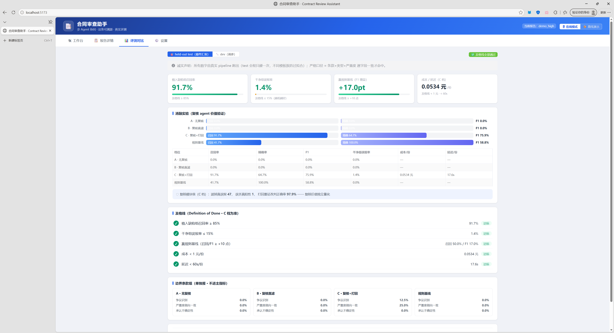
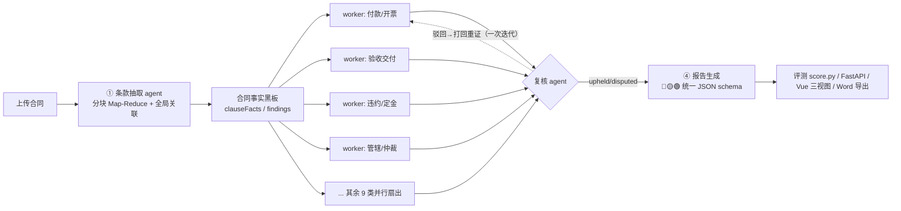

# 合同审查助手（Contract Review Assistant）

> 多 agent 协同的合同审查系统：上传采购/销售合同 → 自动输出「风险条款清单 + 修改建议 + 可溯源法条依据」。
> **诚实声明**：这是初筛助手，输出需**人工终审**，不构成法律意见。评测数字一律真实跑出，禁止伪造。

## 演示截图



**工作台** —— 拖拽上传 / 演出合同一键载入（离线可用），流水线进度实时可视化多 agent 扇出：条款抽取 → 13 类 worker 并行 → 对抗复核（打回重证）→ 报告。



**报告详情** —— 🔴🟡🟢 分级风险卡片流（按严重度排序），展开可见条款原文、**法条依据（条文号 + 版本号）**、修改建议与示范条款；左条款导航红/黄点高亮，双向联动。



**评测对比页** —— 金标准集严格口径指标 + 消融 A/B/C vs 规则基线对比，及格线通过标记（✅/❌），全部数字真实跑出。

## 与"玩具 demo"的分水岭

1. **评测**：金标准集（植入 30 / 干净 20 / 边界 10~15）+ 严格计分口径 + 及格线，数字真实跑出
2. **对抗复核**：复核 agent 过滤误报，价值经**消融实验**（A 无复核 / B 复核直滤 / C 复核+打回重证）验证
3. **法条可溯源**：三档依据（direct/indirect/none），无依据不硬编，禁止虚构法条、禁止旧合同法
4. **规则基线对比**：多 agent 系统必须打赢确定性规则基线（+10 点），证明协同价值

## 架构（LangGraph 多 agent 流水线）



- **合同事实黑板**：LangGraph 结构化共享 state（禁止外部存储），一次解析全链复用；findings 去重（同条款+同类型+同严重度合并，A 档无复核时退化为按 evidence 合并）
- **worker 输入硬预算**：≤8K tokens；法条只取 top-3；引用摘要 ≤3 句/条；超出裁剪
- **复核可插拔**：`REVIEW_MODE=A|B|C`；查证模式默认开（高危"无直接依据"档必须确认"确无直接法条"）

## 快速开始

```bash
# 1. 环境
python -m venv .venv && .venv\Scripts\activate   # Windows
pip install -r requirements.txt
copy .env.example .env                            # 填入 DEEPSEEK_API_KEY / SILICONFLOW_API_KEY

# 2. 生成金标准集（可复现，含 dev/test 拆分 + 标注指南）
python eval/make_dataset.py

# 3. 链路自检（mock/规则模式，无需 key：抽取正则 + worker=规则基线 + 复核放行）
python scripts/smoke_test.py

# 4. 评测（mock 或真实）
python scripts/run-eval.py --split dev            # 43 份 × A/B/C/baseline
python eval/score.py --reports eval/output --split dev

# 5. 法条手册核验（SPEC 2.5：对照官方来源，核验后 --mark）
python scripts/verify_manual.py --check

# 6. 单元测试（黑板 reducer / 抽取 / 规则基线 / 计分 / 预算裁剪）
python -m pytest tests/ -q

# 7. 报告结构校验（213 份真实报告全过）
python scripts/check_report_schema.py
```

## 评测口径（严格，面试背熟版）

> 风险定义为「条款 + 类型 + 严重度」三元组，模型输出与标准答案**逐字段完全一致**才算命中。

- 主指标：召回率 = 命中 / 植入缺陷总数；精确率 = 命中 / 模型输出总数；F1
- 部分分（诊断用，不进简历）：条款 0.4 + 类型 0.3 + 严重度 0.3
- 干净组误报率 = 被判定为风险的条款数 ÷ 条款总数（误报密度）
- 边界组单独报（不进主指标）：争议识别 / 严重度倾向一致 / 承认不确定性
- **三组口径同时输出**：系统级（最终报告）/ 复核模块级（review_results）/ 规则基线
- 消融三档 A/B/C 对比 精确/召回/F1/成本/延迟；及格线以 C 档为准
- 评测集已拆 dev（调参）/ held-out test（最终汇报，全程只碰一次，不同模板族防过拟合）
- 人工抽样复核 ~20% 已做（见 `eval/dataset/meta.json` 的 manualAudit）
- 盲标交叉验证：Qwen（硅基流动，不同家族）质检标注质量，**不用于修正 worker 输出**

### 及格线（Definition of Done，score.py 输出 ✅/❌）

| 指标 | 及格线 |
|---|---|
| 植入缺陷组召回率（C 档系统级） | ≥ 85% |
| 干净组误报率 | ≤ 15% |
| 赢规则基线 | 召回或 F1 ≥ +10 个点 |
| 成本 / 延迟 | < 1 元/份，< 60s/份 |

## 评测结果（真实跑出，held-out test 最终汇报口径）

> 严格口径：`(条款, 风险类型, 严重度)` 三元组与标准答案逐字段完全一致才算命中。

| 指标（C 档：复核+打回） | dev（调参） | **held-out test（最终汇报）** | 及格线 |
|---|---|---|---|
| 植入缺陷组召回率 | 86.4% | **91.7%** | ≥ 85% ✅ |
| 干净组误报率（误报密度） | 8.3% | **1.4%** | ≤ 15% ✅ |
| 赢规则基线 | 召回 +63.6 点 / F1 +37.5 点 | **召回 +50.0 / F1 +17.0** | ≥ +10 点 ✅ |
| 成本 | 0.051 元/份 | **0.053 元/份** | < 1 元 ✅ |
| 延迟（全流水线实测） | ~25s/份 | **17.6s/份** | < 60s ✅ |

- **复核模块级**（C 档 test）：滤掉真误报 47，误杀真阳性 1，打回重证改判正确率 97.9%（复核价值独立量化）
- **规则基线**（对比对象）：test 召回 41.7%——只抓最直接确定性模式（朴素），78% 变体缺陷留给 worker 证明协同价值
- test 集为 held-out 最终汇报（不同模板族、不同种子防过拟合）；数字为最近一次真实运行（LLM 存在小幅随机波动）

### 消融实验（复核 agent 可证伪，dev 全量）

| 档位 | 召回率 | 精确率 | F1 | 干净组误报率 | 说明 |
|---|---|---|---|---|---|
| A 无复核 | 100.0% | 33.8% | 50.6% | 16.7% ❌ | 全量放行 → 误报爆表，精确率低 |
| B 复核直滤 | 86.4% | **67.9%** | **76.0%** | **5.4%** ✅ | 精确率翻倍、误报率降至 5.4% |
| **C 复核+打回** | **86.4%** | 65.5% | 74.5% | 8.3% ✅ | 打回重证 79 次，改判正确率 96.2% |
| 规则基线 | 22.7% | 100% | 37.0% | 0% | 朴素规则，变体缺陷抓不到 |

结论：复核把精确率从 33.8% 提升到 65.5%+（滤掉 76 个真误报、仅误杀 3 个真阳性）；
C 档打回重证后 worker 自撤 79/79（复核驳回质量高），改判正确率 96.2%——对抗复核价值经消融验证。

### 盲标交叉验证（标注质量质检）

硅基流动 **Qwen3.5-122B-A10B**（与 DeepSeek 不同家族，防共偏）盲标植入组抽检：
- 条款级语义一致率 **100%**（5/5），零漏植——植入记录合理、与标注指南一致
- 盲标仅用于评估标注质量，绝不用于修正 worker 输出

## 当前状态

- ✅ **M1（MVP）达标**：LangGraph 流水线 + 合同事实黑板 + 精选手册 RAG + 金标准集 + score.py，**C 档召回/误报/赢基线/成本/延迟全部通过及格线（dev + held-out test）**
- ✅ **M2 完成**：消融实验三档全量（复核价值量化）+ 盲标交叉验证 + FastAPI（集成测试通过）+ Vue 三视图（工作台/报告双向联动/评测对比页，含离线演示模式，缓存为真实导出）
- ✅ **Word 导出**：`POST /export/word`（python-docx 生成正式审阅报告，前端按钮一键下载）——"Web 审查 + 文档落地"行业标准组合
- ✅ **法条手册官方核验（SPEC 2.5）**：62 条逐条机械比对官方全文（民法典双源交叉 + 民诉法/反法/劳动法/个保法/数安法官方源），修正 5 条不符文本，`verified=true`，`verify_manual.py --check` 通过
- ⏳ M3 剩余：Docker 部署（README 截图已完成）

## 目录结构

```
contract-review-assistant/
├── app/
│   ├── graph.py            # LangGraph 流水线（复核可插拔）
│   ├── state.py            # 合同事实黑板 schema + findings reducer（去重规则）
│   ├── nodes/              # extract / workers(13 类) / reviewer / report
│   ├── legal/              # 法条手册 + 混合检索(bge-m3) + 风险矩阵 + 规则基线
│   ├── llm.py / config.py  # LLM 客户端（usage 计费）/ 配置（模型名配置化）
├── eval/
│   ├── make_dataset.py     # 金标准集生成（三组 + 植入记录 + dev/test + 标注指南）
│   ├── score.py            # 计分 + 及格线 + 消融 + 三组口径
│   ├── rule_baseline.py    # 规则基线（与系统同 schema）
│   ├── blind_label.py      # 盲标质检（Qwen）
│   └── dataset/            # dev / test / demo（3 份演出合同）/ 标注指南.md
├── frontend/               # Vue3 + Element Plus 三视图（M2）
├── scripts/                # smoke_test / run-eval / verify_manual
├── .env.example
└── README.md
```

## 多 agent 协作故事（面试讲这套）

任务分解/并行分工 → **合同事实黑板**（共享记忆/一次解析多处复用/跨 worker 组合风险）→ 对抗评审 → **复核打回重证**（agent 间双向迭代，纳入消融实验）
